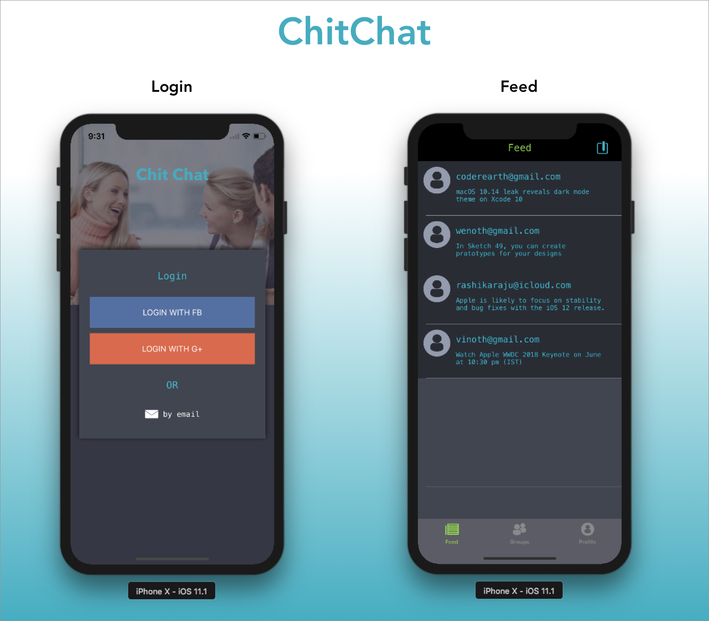
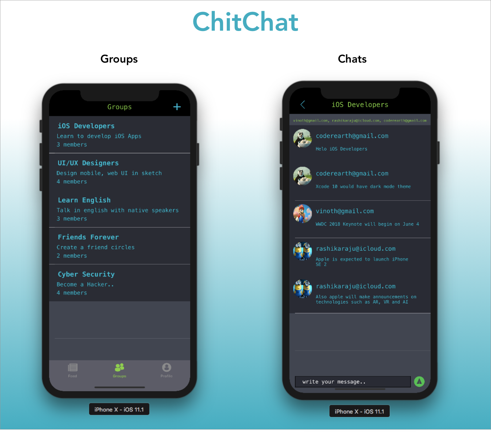

# Chit-Chat
[](https://swift.org)
[](https://twitter.com/vinothvino42)

A simple real time chat application for iOS.

<h3 align="center">

</h3>

<h3 align="center">

</h3>

## Compatibility

This project is written in Swift 4 and requires Xcode 9.1 to build and run.

## Running

  * Create a project in Firebase. See this [Link](https://firebase.google.com/docs/ios/setup)
  * Add ```GoogleService-Info.plist``` to your Xcode project
  * Run the project

## Author

* [Vinoth Vino](https://twitter.com/vinothvino42)
